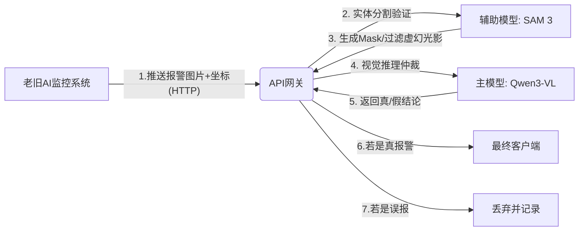
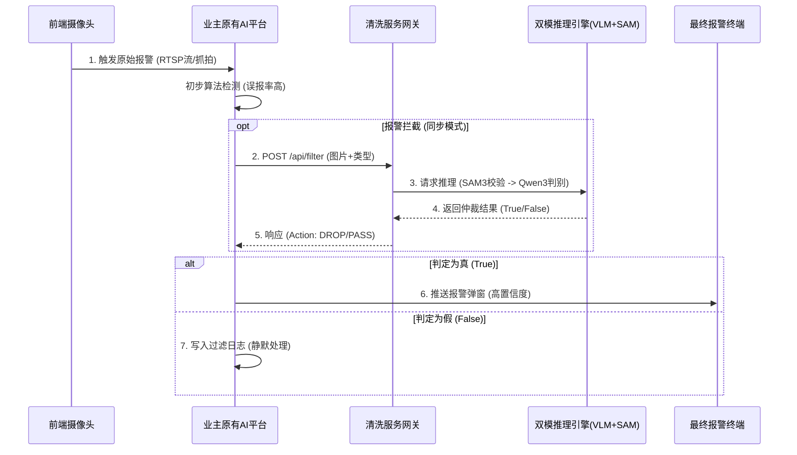

# 基于大模型的AI监控误报二次确认系统

## 1. 项目背景与核心价值

### 1.1 痛点分析
市面上存在大量已建设的AI监控项目（“烂尾”或老旧项目），面临以下困境：
- **算法过时**：早期的CNN小模型泛化能力差，树影、光线变化、动物极易触发误报。
- **维护缺失**：原厂商倒闭或停止维护，无法优化算法。
- **误报风暴**：每天数千条误报导致安保人员直接关闭报警音，系统形同虚设。
- **推倒重来成本高**：业主不愿意废弃已购买的摄像头和服务器硬件。

### 1.2 解决方案核心：旁路“外挂”
不替换原有摄像头，不更改原有网络架构。在局域网内部署一台**“智能清洗服务器”**（AI Filtering Sidecar），通过标准API接收老旧系统的报警图片，利用**多模态大模型（VLM）**进行二次逻辑判断，仅将“真报警”透传给业主端。

**价值主张**：低成本挽救烂尾项目，将“人工复核”变为“AI大模型复核”。

---

## 2. 系统架构与实现方式

### 2.1 逻辑架构：双模引擎 (VLM + SAM)
采用 **"SAM3 实体校验 + Qwen3-VL 逻辑仲裁"** 的双重清洗模式，极大降低光影、烟雾等非实体误报。

### 2.3 数据流通与交互时序 (Data Flow Mechanism)

本系统作为一个**独立的仲裁服务 (Arbitration Service)**，与业主原有监控平台的交互遵循标准的 **Request-Response** 模式。

#### 2.3.1 核心交互时序图

#### 2.3.2 两种集成模式 (Integration Modes)
根据业主系统的开放程度，支持两种数据流通模式：

**模式 A：串行拦截 (Inline Blocking) - *推荐***
*   **机制**：清洗服务串联在“报警产生”与“报警推送”之间。
*   **流程**：原有AI平台产生报警后，**挂起 (Hold)** 推送动作，先调用我们的清洗接口。只有当接口返回 `Action: PASS` 时，才放行该报警至客户端。
*   **优势**：终端用户（保安）实现“零误报”体验，彻底根除无效干扰。

**模式 B：旁路标记 (Sidecar Tagging) - *兜底方案***
*   **机制**：当原有平台无法修改代码或不支持Webhook回调时使用。
*   **流程**：清洗服务通过数据库轮询或旁路抓包获取报警图片，异步进行分析。分析结果推送到我们独立的 Dashboard 或通过即时通讯工具（钉钉/企微）通知用户。
*   **优势**：对原有系统 **零改动**，实施风险最低。

#### 2.3.3 数据契约 (Data Contract)
*   **输入 (Ingress)**: 必须包含 `Image` (Base64/URL) 和 `AlarmType` (业务语义，如"fire", "intrusion")。可选字段 `BBox` (原系统框) 可辅助加速 SAM3 收敛。
*   **输出 (Egress)**: 
    *   `Decision`: `PASS` (放行) / `DROP` (拦截)
    *   `Confidence`: `0.0 - 1.0` (置信度)
    *   `Reason`: 结构化拦截原因 (如 `"target_is_animal"`, `"shadow_interference"`)

## 3. 核心技术选型 (2025最新版)

### 3.1 主模型：Qwen3-VL (Alibaba Cloud)
*   **版本选择**: **Qwen3-VL-8B-Instruct** (高性价比) 或 **Qwen3-VL-32B** (高精度)。
*   **核心优势**:
    *   **原生空间感知**: 相比v2，Qwen3-VL对物体相对位置、遮挡关系的理解达到了新高度，极少被错位透视欺骗。
    *   **视觉Agent能力**: 能更好地理解复杂场景（如“工人在操作机器” vs “工人在睡觉”）。
    *   **长窗口**: 支持高分辨率输入，能看清远处的微小目标。

### 3.2 辅助检测：Segment Anything 3 (Meta)
*   **版本选择**: **SAM 3 (Base/Large)**
*   **核心优势**:
    *   **视频/时序理解**: 如果老系统能提供短视频，SAM 3能通过时序一致性判断物体是否在“动”，有效过滤静态海报误报。
    *   **Zero-shot分割**: 对未知物体的分割精度极高，能精准扣出“闯入物”的轮廓，供Qwen3-VL分析。

### 3.3 推理框架
*   **vLLM (最新版)**: 完美支持 Qwen3-VL 的各种尺寸，且已集成对多模态输入的优化。
*   **TorchScript / TensorRT**: 用于加速 SAM 3 的推理。

---

## 4. 硬件配置与承载能力详测 (中国区合规版)

### 4.1 关键性能瓶颈与优化策略 (解决推理超时)
**实战痛点**：实测发现，若让 Qwen3-VL 输出全图目标的 BBox（检测框），在密集场景（如人群、杂物堆）下，模型会生成数千个坐标 Token，导致单张图片推理耗时飙升至 **10s - 30s**，严重阻塞服务。

**优化策略 (必须执行)**：
*   **分工明确**：利用 **SAM 3** (传统的非生成式模型) 负责“找位置”和“画框”，它的速度是恒定的。
*   **大模型降维**：**严禁**让 Qwen3-VL 输出 BBox。仅将 SAM 3 切割出的局部图或带有红框标记的原图喂给 Qwen3-VL，并强制其只回答 **"Yes" / "No"** 或简短的分类标签。
*   **效果**：将 Qwen3-VL 的输出长度限制在 5 个 token 以内，无论画面多复杂，推理时间都能稳定控制在 **0.5s - 1.5s** 之间。

### 4.2 测算模型 (修正版)
基于上述优化策略（只做 VQA 判断，不做检测生成）：
*   **单次处理耗时 (T_total)**:
    *   SAM 3 提取/画框: ~0.1s
    *   Qwen3-VL (Int4) 逻辑判断: ~0.8s (保守估计)
    *   显存交换与IO: ~0.1s
    *   **单张综合耗时**: **~1.0 秒** (即使在复杂场景下)

### 4.3 推荐配置方案对比表 (CN内陆合规版)

| 配置方案 | **A. 入门/边缘端** (成本优先) | **B. 主流/机房端** (性能优先 - 双卡流水线) | **C. 旗舰/中心端** (海量并发) |
| :--- | :--- | :--- | :--- |
| **显卡 (GPU)** | **1x NVIDIA RTX 4090 D (24GB)** | **2x NVIDIA RTX 4090 D (24GB)** | **2x NVIDIA H20 (96GB)** |
| **CPU** | Intel Core i7-14700K | AMD Threadripper 7960X (提供足够PCIe通道) | Dual Intel Xeon Platinum |
| **架构模式** | **单卡串行** | **双卡异构流水线 (Pipeline)** | **多卡张量并行 (TP)** |
| **部署策略** | 同一张卡分时复用。 先跑SAM3，再跑Qwen。 | **GPU 0**: 专跑 **SAM 3** (视觉感知) **GPU 1**: 专跑 **Qwen3-VL** (逻辑推理) | Qwen3-VL-72B 跨卡部署 SAM 3 独立部署 |
| **吞吐优势** | 节省成本，但无法并行处理。 | **吞吐量翻倍**。 无算力争抢，GPU 1 显存全用于KV Cache，并发极高。 | 极致的单次推理速度和并发量。 |
| **参考造价** | **¥ 2.8万** | **¥ 7万 - 9万** | **¥ 40万+** |

### 4.4 深度分析：为什么“双卡分工”是最优解？
针对 **方案 B**，我们强烈推荐 **"双卡分工"** 而非简单的 "两张卡跑两个一样的程序"，原因如下：

1.  **规避算力争抢 (Compute Contention)**:
    *   **SAM 3 特性**: 属于 Vision Encoder 密集型任务。在对 1024x1024 图片进行编码时，会瞬间占满 CUDA Core 计算资源。
    *   **Qwen3-VL 特性**: 属于 Memory/Compute 混合型任务。
    *   **冲突**: 如果两者在同一张卡上运行，Qwen 的推理会被 SAM 3 "卡住"，导致延迟不可控。双卡物理隔离完美解决了这个问题。

2.  **流水线效应 (Pipelining)**:
    *   系统形成流水线：`数据 -> GPU 0 (SAM3画框) -> CPU中转 -> GPU 1 (Qwen判别) -> 结果`。
    *   当 GPU 1 正在判断 **第 N 张** 图片的真伪时，GPU 0 已经开始处理 **第 N+1 张** 图片的分割。
    *   这使得整体系统的 FPS (每秒处理帧数) 几乎翻倍。

3.  **显存利用率最大化**:
    *   GPU 0 (跑 SAM3) 显存会大量空闲，可以用来**预加载**下一批图片，或运行一个轻量级的 YOLOv10 做极速初筛。
    *   GPU 1 (跑 Qwen) 24GB 显存只有模型占用，剩下的 **16GB+** 全部可以用作 **KV Cache**，这意味着它可以同时 Batch 处理 **30-50 个** 并发请求，极大提升吞吐。

### 4.5 并发能力与承载路数推算表 (修正后)

| 指标 | 方案 A (单卡串行) | 方案 B (双卡流水线) | 方案 C (H20集群) |
| :--- | :--- | :--- | :--- |
| **稳定吞吐量 (QPS)** | **1 - 1.5 张/秒** | **4 - 6 张/秒** (效率提升显著) | **15 - 20 张/秒** |
| **每分钟处理能力 (APM)** | 60 - 90 张 | **240 - 360 张** | 900+ 张 |
| **每天最大处理量 (24h)** | ~ 10万 张 | **~ 50万 张** | ~ 130万 张 |
| **推荐承载路数** | **300 - 500 路** | **1,500 - 2,500 路** | **5,000+ 路** |

---

## 5. 合作伙伴快速接入指南 (领导决策版)

### 5.1 核心理念：零侵入、低门槛
我们为业主和集成商提供的是一个**“全兼容的AI清洗黑盒”**。
*   **不换摄像头**：利旧现有资产。
*   **不改内网**：只需一根网线接入。
*   **不挑平台**：无论是海康、大华还是不知名小厂的系统，只要能发出报警，我们就能接。

### 5.2 极简“三步走”接入流程

1.  **物理连接 (Plug)**
    *   将我们的“智能清洗服务器”接入监控局域网。
    *   *耗时：10分钟*

2.  **数据导流 (Connect)**
    *   **方式一（推荐）**：在原有的报警平台中配置一条“转发规则”，把报警图片推送到我们的服务器IP。
    *   **方式二（兜底）**：如果老系统太封闭，我们提供一个轻量级抓取脚本，自动从老系统的数据库或文件夹里“搬运”报警图片。
    *   *耗时：1-2小时*

3.  **效果验收 (Play)**
    *   开启清洗功能。业主在我们的可视化大屏上直观看到：**左边是“拦截掉的误报”（如飞虫、树影），右边是“确认的真警”**。
    *   *耗时：即刻见效*

### 5.3 “万能插座”式对接标准
为了最大化兼容性，我们定义了一套行业最通用的对接标准，业主的技术人员无需学习复杂代码，只需按以下格式“填空”即可。

**我们只需要对方传过来三样东西：**
1.  **一张图**：报警时刻的现场快照（必选）。
2.  **一句话**：告诉我们这报的是什么（例如：“有人闯入”、“未戴安全帽”）（必选）。
3.  **一个框**（可选）：如果老系统能告诉我们它觉得哪里有问题（画个框），我们会重点检查那里；如果没有，我们自己全屏找。

> **给合作伙伴的承诺**：只要你们的系统能把图片导出来（无论是通过HTTP、FTP还是RTSP），剩下的清洗、去重、二次判断全部由我们的“外挂大脑”自动完成，**原系统无需做任何算法层面的修改**。

## 6. 实施路线建议

1.  **POC验证 (第1周)**:
    *   使用 RTX 4090/5090 搭建环境。
    *   部署 **Qwen3-VL-8B** 和 **SAM 3**。
    *   编写Python脚本串联：`Image -> SAM3 (Check Mask) -> Qwen3 (Check Logic) -> Result`。
2.  **数据清洗 (第2周)**:
    *   采集1000张历史误报图片，测试双模引擎的过滤率。
    *   重点关注：SAM 3 是否能成功忽略光影？Qwen3 是否能识别雕塑和真人？
3.  **交付上线**:
    *   封装为 Docker 镜像，一键部署。
